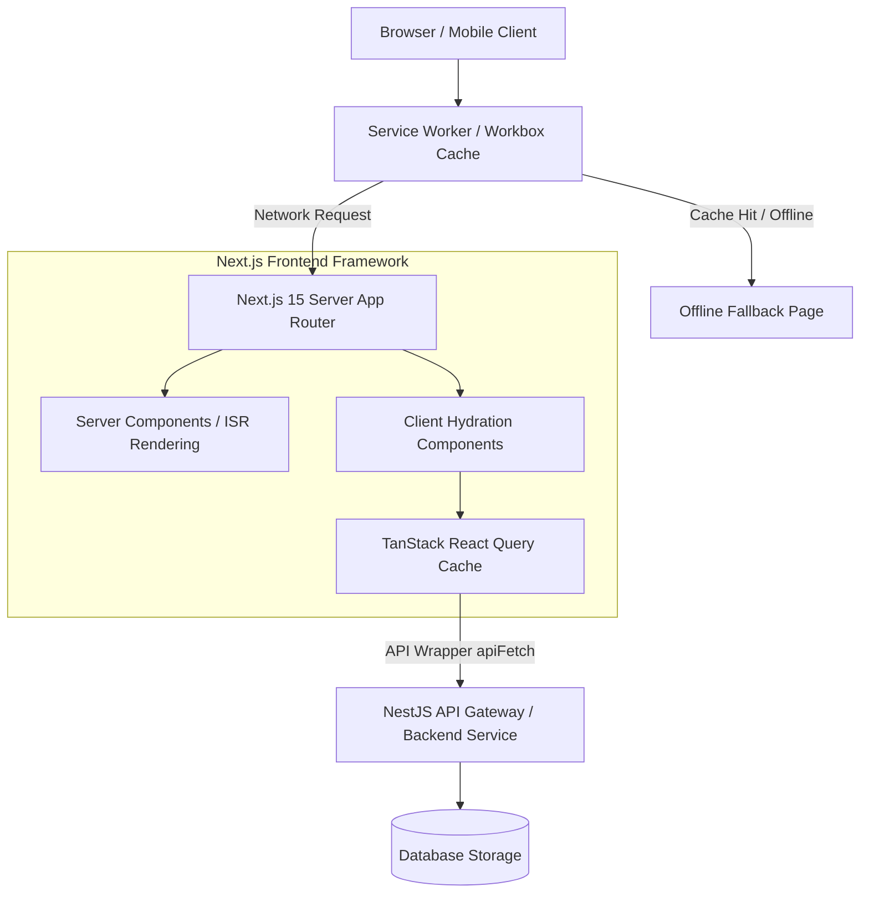
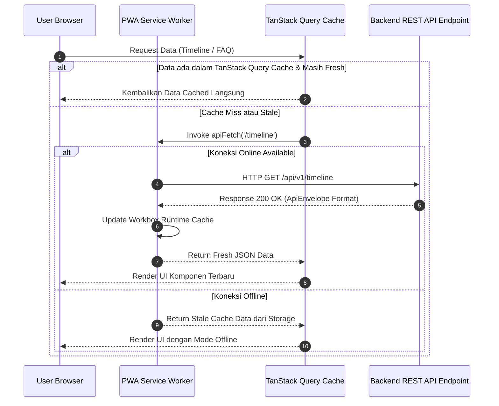
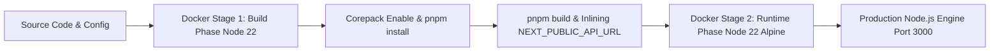

# BHUMARA Frontend Platform: Web Media Interaktif PKKMB 2026

Selamat datang di repositori resmi **BHUMARA Frontend Application**, platform web interaktif untuk pelaksanaan Pengenalan Kehidupan Kampus bagi Mahasiswa Baru (PKKMB) Telkom University Purwokerto Tahun 2026. Platform ini dirancang mengedepankan estetika visual bertema jungle atmosferik, performa tinggi, aksesibilitas prima, serta dukungan Progressive Web Application (PWA).

---

## Ringkasan Proyek

Platform web BHUMARA PKKMB 2026 berfungsi sebagai pusat informasi terpadu, modul kegiatan interaktif, dan panduan digital bagi seluruh mahasiswa baru Telkom University Purwokerto. Aplikasi ini mengintegrasikan seluruh kebutuhan informasi kampus mulai dari jadwal acara, direktori organisasi mahasiswa, platform akademik, tur kampus, buku panduan digital, hingga kanal bantuan resmi.

### Nilai Bisnis dan Tujuan Utama
* **Pusat Informasi Terpusat**: Menyediakan sumber informasi resmi yang cepat, akurat, dan dapat diakses dari berbagai perangkat.
* **Pengalaman Pengguna yang Imersif**: Menghadirkan antarmuka bertema alam (jungle decoration system) dengan animasi halus dan navigasi responsif.
* **Ketersediaan Offline**: Menggunakan teknologi PWA sehingga dokumen dan informasi penting tetap dapat diakses meskipun jaringan internet tidak stabil.
* **Arsitektur Modular dan Scalable**: Dibangun menggunakan Next.js 15 App Router dan TypeScript untuk memastikan keterawatan kode jangka panjang.

---

## Tech Stack dan Spesifikasi Teknologi

| Kategori | Teknologi / Pustaka | Versi | Peran dan Fungsi |
| :--- | :--- | :--- | :--- |
| **Framework Utama** | Next.js (App Router) | 15.0.0 | Routing modern, Server Components, Server-Side Rendering (SSR), Incremental Static Regeneration (ISR) |
| **Bahasa Pemrograman** | TypeScript | 5.6.2 | Strict type safety, penanganan antarmuka data, dan pencegahan bug runtime |
| **Core UI Library** | React | 19.0.0 | Library utama pembangunan antarmuka berbasis komponen |
| **Styling & CSS** | Tailwind CSS & PostCSS | 3.4.13 / 8.4.47 | Framework utilitas CSS dengan kustomisasi palette warna bertema jungle (forest, sage, rust, sand, cream, bark) |
| **Engine Animasi** | Framer Motion & Anime.js | 11.11.1 / 3.2.2 | Transisi halaman, stagger animation, micro-interactions, dan efek dekoratif dinamis |
| **Smooth Scrolling** | Lenis Smooth Scroll | 1.3.25 | Pengalaman scroll yang halus pada seluruh halaman web |
| **Data Fetching & State** | TanStack React Query | 5.59.0 | Manajemen state asinkron, caching otomatis, revalidation, dan optimisasi query |
| **Validasi Schema** | Zod | 3.23.8 | Validasi struktur data API dan skema formulir autentikasi |
| **PWA Engine** | @ducanh2912/next-pwa | 10.2.9 | Service Worker, Workbox runtime caching, offline fallbacks, dan Web App Manifest |
| **Ikonografi** | Lucide React | 0.446.0 | Set ikon vektor konsisten dan berbobot ringan |
| **Tipografi** | Google Fonts (next/font) | Built-in | Spicy Rice (Headline Display) & Noto Serif (Body Text) |
| **Containerization** | Docker | Node 22 Alpine | Multi-stage build image untuk deployment siap produksi |

---

## Arsitektur Sistem dan Prinsip Rekayasa

Aplikasi ini mengadopsi prinsip arsitektur perangkat lunak modern:

1. **Next.js App Router & Server Components Strategy**:
   * Komponen publik dan statis memanfaatkan Server Components untuk mempercepat First Contentful Paint (FCP) dan SEO optimal.
   * Interaktivitas kompleks seperti modal detail, filter pencarian, dan formulir menggunakan Client Components (`'use client'`).

2. **Unified Data Layer & API Envelope**:
   * Komunikasi HTTP terpusat melalui wrapper `apiFetch` pada file `src/lib/api/client.ts`.
   * Seluruh respons backend dibungkus dalam format standar `ApiEnvelope<T>` dengan mitigasi kesalahan terstruktur.

3. **Progressive Web Application (PWA) Offline First**:
   * Menggunakan strategi `StaleWhileRevalidate` untuk endpoint API publik (`/api/v1/*`).
   * Fallback otomatis ke halaman `/offline` saat perangkat kehilangan koneksi jaringan.

4. **Design System & Visual Decorator Engine**:
   * Menggunakan token warna khusus HSL yang dikonfigurasikan di `tailwind.config.ts`.
   * Sistem ornamen dekoratif jungle yang modular (`src/components/ui/jungle-decor.tsx`) untuk memberikan pengalaman estetika visual enterprise.

---

## Diagram Sistem dan Alur Kerja (UML & Flowcharts)

Berikut adalah sekumpulan diagram Mermaid yang mendeskripsikan arsitektur, alur penggunaan, dan alur data platform:

### 1. High Level Architecture Diagram
Diagram ini memperlihatkan interaksi antara layer antarmuka pengguna, strategi render Next.js, layer data API, dan mekanisme PWA caching:



### 2. Use Case Diagram
Diagram ini menggambarkan hak akses dan aktivitas interaktif pengguna pada platform:

```mermaid
graph LR
    actor User as Mahasiswa Baru / Pengunjung
    actor Admin as Panitia PKKMB

    subgraph Platform Frontend BHUMARA
        usecase UC1 as Jelajahi Landing Page & Banner Interaktif
        usecase UC2 as Lihat Rangkaian Acara / Timeline Agenda
        usecase UC3 as Eksplorasi Ormawa & UKM Kampus
        usecase UC4 as Akses Platform Akademik (iGracias, CeLOE)
        usecase UC5 as Jelajahi Campus Tour & Denah
        usecase UC6 as Baca Digital Guidebook PKKMB
        usecase UC7 as Cari Pertanyaan pada Accordion FAQ
        usecase UC8 as Kirim Pesan / Hubungi Helpdesk Panitia
        usecase UC9 as Autentikasi Login Pengurus / Admin
    end

    User --> UC1
    User --> UC2
    User --> UC3
    User --> UC4
    User --> UC5
    User --> UC6
    User --> UC7
    User --> UC8

    Admin --> UC9
```

### 3. Sequence Diagram: Data Fetching & Offline Caching Flow
Diagram berikut menjelaskan urutan pemanggilan data agenda timeline atau FAQ melalui TanStack Query dan Service Worker:



### 4. Component Relationship Diagram
Diagram struktur hubungan komponen antarmuka dan dekorasi visual pada layout utama:

```mermaid
graph TD
    RootLayout[src/app/layout.tsx] --> Providers[src/providers.tsx - QueryClientProvider]
    Providers --> SmoothScroll[SmoothScrollProvider - Lenis Engine]
    SmoothScroll --> ScrollBar[ScrollProgressBar]
    SmoothScroll --> DevCleaner[DevServiceWorkerCleaner]
    SmoothScroll --> Splash[SplashScreen Component]
    SmoothScroll --> Nav[Navbar Layout]
    SmoothScroll --> MainArea[Main Content Area PageTransition]
    SmoothScroll --> JungleBottom[JungleCornersBottom Decorator]
    SmoothScroll --> Foot[Footer Layout]

    MainArea --> PageLanding[src/app/(public)/page.tsx]
    PageLanding --> FullHero[FullpageHeroExperience]
    PageLanding --> FeatureGrid[Features Stagger Grid]
    PageLanding --> TimelineGrid[ExpandingTimelineGrid]
    PageLanding --> CampusGallery[SuasanaKampusGallery]
    PageLanding --> FAQComp[FaqAccordion UI]
```

### 5. Deployment Container Diagram
Proses eksekusi dan kontainerisasi aplikasi dari kode sumber hingga server produksi:



---

## Struktur Direktori Proyek

Struktur folder terorganisir menggunakan standar modularitas App Router Next.js:

```text
frontend/
├── .dockerignore
├── .env.example                 # Contoh berkas konfigurasi environment variables
├── .env.local                   # Konfigurasi environment lokal
├── Dockerfile                   # Konfigurasi containerization multi-stage build Node 22
├── next.config.ts               # Konfigurasi Next.js, PWA Workbox caching, & gambar
├── package.json                 # Manifest dependensi dan skrip proyek
├── pnpm-lock.yaml               # Lockfile manajemen dependensi pnpm
├── postcss.config.mjs           # Konfigurasi PostCSS untuk Tailwind CSS
├── tailwind.config.ts           # Desain sistem warna bertema HSL jungle & ekstensi
├── tsconfig.json                # Konfigurasi TypeScript compiler strict mode
├── public/                      # Asset publik statis (favicon, logo, ikon PWA)
└── src/
    ├── providers.tsx            # Context provider utama (TanStack Query Client)
    ├── app/                     # Next.js App Router routes & layouts
    │   ├── globals.css          # Stylesheet global, CSS variables, & utilitas animasi
    │   ├── layout.tsx           # Root layout dengan provider, font, navbar, & footer
    │   ├── manifest.ts          # Generator PWA Web App Manifest dinamis
    │   ├── (auth)/              # Route group untuk alur otentikasi
    │   │   └── login/           # Halaman & form login pengurus/admin
    │   ├── (public)/            # Route group untuk halaman publik
    │   │   ├── page.tsx         # Landing Page utama PKKMB BHUMARA 2026
    │   │   ├── academic/        # Platform informasi layanan akademik
    │   │   ├── campus-tour/     # Modul tur kampus interaktif & denah
    │   │   ├── contact/         # Halaman Helpdesk resmi & kontak panitia
    │   │   ├── explore-ormawa/  # Katalog Organisasi Mahasiswa & UKM
    │   │   ├── faq/             # Pusat pencarian pertanyaan umum (FAQ)
    │   │   ├── guidebook/       # Digital Reader Buku Panduan PKKMB (PDF)
    │   │   ├── quiz/            # Modul kuis interaktif wawasan kampus
    │   │   ├── roblox/          # Informasi tur virtual kampus Roblox
    │   │   └── timeline/        # Halaman detail rincian acara & agenda
    │   └── offline/             # Halaman fallback saat perangkat tanpa internet
    ├── components/              # Komponen modular reusable
    │   ├── academic/            # Komponen kartu & detail ekspansi akademik
    │   ├── campus-tour/         # Komponen titik lokasi & deskripsi fasilitas
    │   ├── explore-ormawa/      # Komponen grid, filter, & detail ORMAWA/UKM
    │   ├── guidebook/           # Reader PDF interaktif dengan kontrol navigasi
    │   ├── landing/             # Komponen khusus landing page (Hero, Gallery)
    │   ├── layout/              # Navbar, Footer, Scroll-to-top
    │   ├── timeline/            # Grid timeline, tiket hari, & modal detail acara
    │   └── ui/                  # Reusable UI primitives, animasi, & dekorasi jungle
    └── lib/                     # Library utilitas, konfigurasi, & integrasi API
        ├── config.ts            # Pembacaan environment variables (API_URL)
        ├── validation.ts        # Skema validasi Zod untuk formulir
        └── api/                 # Layer HTTP client & query fetching
            ├── client.ts        # Wrapper fetch universal dengan handling error
            └── queries.ts       # Definisi fungsi fetcher & tipe data API
```

---

## Rincian Fitur Utama

### 1. Fullpage Hero Experience & Brand Storytelling
* **Tampilan Interaktif**: Hero section imersif yang menampilkan filosofi, tema, makna logo, dan makna maskot PKKMB BHUMARA 2026.
* **Scroll Snap Deck**: Navigasi halaman yang intuitif menggunakan integrasi Lenis Smooth Scroll dan Framer Motion.

### 2. Rangkaian Acara (Interactive Timeline)
* **Expanding Grid System**: Menampilkan daftar agenda harian PKKMB yang dapat diperluas untuk melihat detail waktu, lokasi, deskripsi, dan daftar cek perlengkapan.
* **Integrasi API**: Mengambil data jadwal terkini dari backend secara otomatis melalui TanStack Query.

### 3. Explore Ormawa & UKM
* **Katalog Organisasi**: Informasi menyeluruh mengenai Organisasi Mahasiswa (BEM, DPM, HIMA) dan Unit Kegiatan Mahasiswa (UKM) di kampus.
* **Detail Card**: Tampilan kartu interaktif dengan deskripsi, divisi, media sosial, dan kontak organisasi.

### 4. Platform Akademik Hub
* **Portal Informasi Akademik**: Akses cepat menuju sistem informasi penting seperti iGracias Telkom University, CeLOE LMS, OpenLibrary, dan Microsoft Office 365.

### 5. Campus Tour & Denah Fasilitas
* **Peta Fasilitas Kampus**: Menelusuri titik penting kampus mulai dari gedung perkuliahan, laboratorium, perpustakaan, hingga fasilitas olahraga.

### 6. Interactive Digital Guidebook Reader
* **PDF Viewer Built-in**: Pembaca dokumen panduan digital resmi peserta PKKMB yang dilengkapi fitur zoom, navigasi halaman, dan opsi unduh file PDF.

### 7. Pusat Informasi FAQ Accordion
* **Filter dan Pencarian**: Pengelompokan pertanyaan berdasarkan kategori serta pencarian cepat responsif.

### 8. PWA Capability & Offline Mode
* **Dukungan Offline**: Berkas dan halaman utama tersimpan secara otomatis di Service Worker sehingga pengguna tetap dapat membaca informasi kritis tanpa internet.

### 9. Helpdesk & Sekretariat Panitia
* **Kontak Terpadu**: Integrasi langsung dengan WhatsApp Helpdesk official, Instagram official, Email panitia, dan lokasi Google Maps Sekretariat.

---

## Layer Integrasi API dan Data Handling

Seluruh transaksi data menggunakan arsitektur antarmuka standar:

### Standard API Response Envelope
```typescript
type ApiEnvelope<T> = {
  success: boolean;
  data: T;
  meta?: unknown;
  error?: {
    code: string;
    message: string;
  };
};
```

### Mekanisme API Fetching (`src/lib/api/client.ts`)
Fungsi `apiFetch` bertindak sebagai pustaka universal pemanggilan REST API:
* Menambahkan header `Content-Type: application/json` secara otomatis.
* Mengirimkan opsi `credentials: 'include'` untuk mengelola cookie otentikasi session/refresh token.
* Melakukan throw Error terstruktur jika status HTTP bernilai gagal atau properti `success` pada envelope bernilai `false`.

---

## Variable Environment

Konfigurasikan berkas `.env.local` pada direktori root `frontend/`:

```env
# URL Endpoint Backend API Gateway (Default: NestJS Server)
NEXT_PUBLIC_API_URL=http://localhost:4000/api/v1

# Pengaturan PWA pada Environment Pengembangan (Optional: true / false)
ENABLE_PWA_DEV=false
```

---

## Panduan Memulai dan Cara Menjalankan Project

### Prasyarat Sistem
* **Node.js**: Versi `>= 22.0.0`
* **Package Manager**: `pnpm` (disarankan via Corepack) atau `npm` / `yarn`
* **Docker Engine**: Optional, untuk pengujian kontainer produksi

### 1. Instalasi Dependensi
Buka terminal pada folder `frontend` lalu jalankan perintah berikut:

```bash
pnpm install
```

### 2. Menjalankan Server Pengembangan (Lokal)
Jalankan server Next.js pada mode pengembangan:

```bash
pnpm dev
```

Aplikasi akan berjalan secara lokal pada URL `http://localhost:3000`.

### 3. Pemeriksaan Kode dan Strict Typecheck
Gunakan skrip berikut untuk memastikan tidak ada kesalahan sintaks atau kesalahan tipe data TypeScript:

```bash
# Pemeriksaan tipe data TypeScript
pnpm typecheck

# Linting kode dengan Next.js Linter
pnpm lint
```

### 4. Build dan Running Mode Produksi (Manual)
Untuk menguji hasil build produksi secara lokal:

```bash
# Kompilasi aplikasi Next.js
pnpm build

# Menjalankan server produksi
pnpm start
```

### 5. Menjalankan Menggunakan Docker Kontainer
Untuk membangun dan menjalankan aplikasi di dalam lingkungan Docker terkontainerisasi:

```bash
# Membangun image Docker
docker build -t bhumara-frontend .

# Menjalankan kontainer pada port 3000
docker run -d -p 3000:3000 --name bhumara-frontend-container bhumara-frontend
```

---

## Lisensi dan Hak Cipta

Hak Cipta (c) 2026 **BEM Telkom University Purwokerto & Tim Pengembang PKKMB BHUMARA 2026**. Seluruh Hak Dilindungi Undang-Undang.
